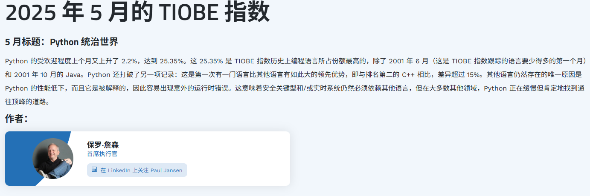
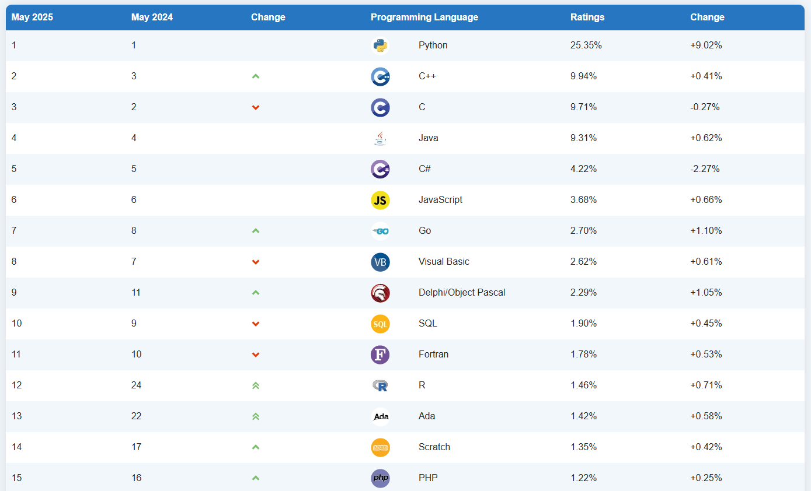
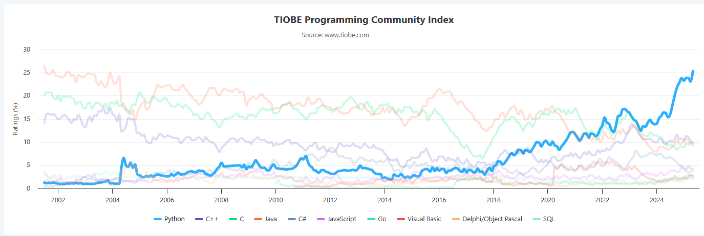

## 1. [TIOBE指数](https://www.tiobe.com/tiobe-index/)
在TIOBE官网一篇《Python统治世界》的文章占据首页。

> Python 的受欢迎程度上个月又上升了 2.2%，达到 25.35%。这 25.35% 是 TIOBE 指数历史上编程语言所占份额最高的。
> Python 还打破了另一项记录：这是第一次有一门语言比其他语言有如此大的领先优势，即与排名第二的 C++ 相比，差异超过 15%。（2025年5月）

## 2. 历史变化

随着AI的不断发展，Python语言成为最流行的编程语言，这就是为什么学习Python的原因。
